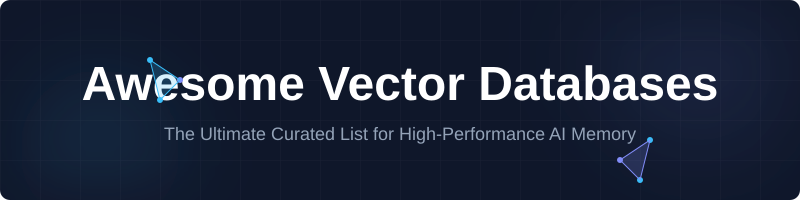

  

  # Awesome Vector Databases 🚀
  
  **A curated list of high-performance Vector Databases, SaaS products, and Open-Source projects.**
  
  
  
  
  
  

  ---
  
  

    <a href="#saas-products">SaaS Products</a> •
    <a href="#open-source-github-projects">Open-Source</a> •
    <a href="#why-vector-databases">Why Vector DBs?</a> •
    <a href="#contributing">Contributing</a>
  

  

## 🌟 Overview

Welcome to the **Awesome Vector Databases** repository! 📚 This is the ultimate collection of specialized databases optimized for **storing, indexing, and querying high-dimensional vector embeddings**. 

Whether you are building a **Retrieval-Augmented Generation (RAG)** system, a recommendation engine, or multimodal AI agents, choosing the right vector store is critical for performance and scalability. ⚡

> **SEO Keywords:** Vector Database, RAG, Embeddings, Semantic Search, Similarity Search, LLM Memory, AI Infrastructure, Vector Search Engine, Milvus, Pinecone, Weaviate, Qdrant, Chroma, pgvector.

---

## 🏗️ Why Vector Databases?

Vector databases are the "memory" of modern AI. Unlike traditional relational databases, they are designed to:
- 🔍 **Perform Similarity Search:** Find the "nearest neighbors" in high-dimensional space.
- 🚀 **Scale to Billions of Vectors:** Efficiently handle massive embedding datasets.
- 🧠 **Power AI Agents:** Provide long-term memory for LLMs.
- 📂 **Support Hybrid Search:** Combine keyword search with semantic search.

---

## 📊 SaaS Products (Managed Services)

### 💎 Core Vector Database Platforms

| Product | Description | Company Size | Pricing | Free Tier Limit |
| :--- | :--- | :--- | :--- | :--- |
| **[MongoDB Atlas](https://www.mongodb.com/products/platform/atlas-vector-search)** | Integrated vector search in NoSQL. | **~$15B** | Cluster-based | 512MB storage (M0) |
| **[Supabase](https://supabase.com/docs/guides/ai)** | Managed PostgreSQL with pgvector. | **$10.5B** | $25/mo Pro | 500MB DB storage |
| **[Astra DB](https://www.datastax.com/products/astra)** | Cloud-native Cassandra-based. | **$1.6B+** | Credit-based | $25/mo credit |
| **[Neon](https://neon.tech/)** | Serverless Postgres with autoscaling. | **~$1B** | $5/mo min | 0.5GB storage |
| **[Pinecone](https://www.pinecone.io/)** | High-performance managed vector DB. | **$750M+** | Usage-based | 2GB storage |
| **[Zilliz Cloud](https://zilliz.com/)** | Managed version of Milvus. | **$600M+** | vCU-based | 5GB storage |
| **[Qdrant Cloud](https://qdrant.tech/)** | Rust-based efficiency. | **$250M+** | Hourly billing | 1GB RAM Free |
| **[Weaviate Cloud](https://weaviate.io/)** | Semantic search first. | **$200M** | Dimension-based | 1GB RAM Free |
| **[Momento Vector](https://www.gomomento.com/services/vector-index)** | Low-latency serverless index. | **$150M+** | Throughput-based| 5GB transfer/mo |
| **[Upstash Vector](https://upstash.com/products/vector)** | Serverless pay-as-you-go. | **$100M+** | Request-based | 20K queries/mo |

---

## 📂 Open-Source GitHub Projects

### 🛠️ Dedicated Vector Databases

- **[Weaviate](https://github.com/weaviate/weaviate)** 🏆  
  Native multimodal support, GraphQL + REST, and excellent hybrid search.
  
- **[Milvus](https://github.com/milvus-io/milvus)** ☁️  
  Highly scalable, designed for massive embedding workloads.
  
- **[Qdrant](https://github.com/qdrant/qdrant)** 🦀  
  Rust-based, high performance with rich filtering and payload support.
  
- **[Chroma](https://github.com/chroma-core/chroma)** 🎨  
  Developer-first, perfect for local-to-production RAG apps.
  
- **[pgvector](https://github.com/pgvector/pgvector)** 🐘  
  The industry standard for vector search in PostgreSQL.
  
- **[LanceDB](https://github.com/lancedb/lancedb)** ⚡  
  Modern, built on Lance format with zero-copy capabilities.

### 📚 Specialized Libraries

- **[Faiss](https://github.com/facebookresearch/faiss)** — Facebook's library for dense vector similarity search.
- **[HNSWlib](https://github.com/nmslib/hnswlib)** — Fast HNSW graph implementation.
- **[Vespa](https://github.com/vespa-engine/vespa)** — Big data serving engine with powerful ranking.
- **[Redis Stack](https://github.com/redis/redis)** — Real-time vector search in Redis.

---

## 📈 Star History

  <picture>
    <source media="(prefers-color-scheme: dark)" srcset="https://api.star-history.com/chart?repos=ishandutta2007/Awesome-Vector-Databases&type=date&theme=dark&legend=bottom-right" />
    <source media="(prefers-color-scheme: light)" srcset="https://api.star-history.com/chart?repos=ishandutta2007/Awesome-Vector-Databases&type=date&legend=bottom-right" />
    
  </picture>

---

## 🤝 Contributing

Contributions are what make the open-source community an amazing place to learn, inspire, and create. Any contributions you make are **greatly appreciated**. 💖

1. Fork the Project
2. Create your Feature Branch (`git checkout -b feature/AmazingFeature`)
3. Commit your Changes (`git commit -m 'Add some AmazingFeature'`)
4. Push to the Branch (`git push origin feature/AmazingFeature`)
5. Open a Pull Request

---

## ⚖️ Disclaimer

- This list is **community-curated** and not exhaustive.
- Performance varies by use case. Always benchmark with your own data! 📊

  
  
Made with ❤️ for the AI community

